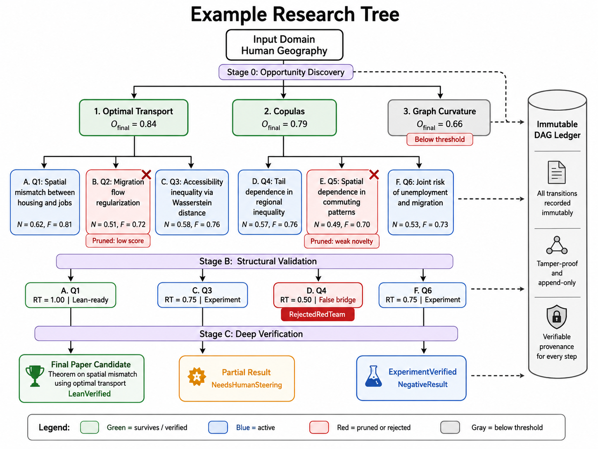
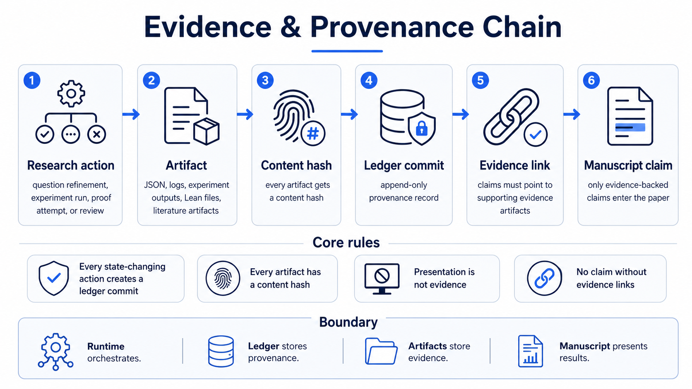
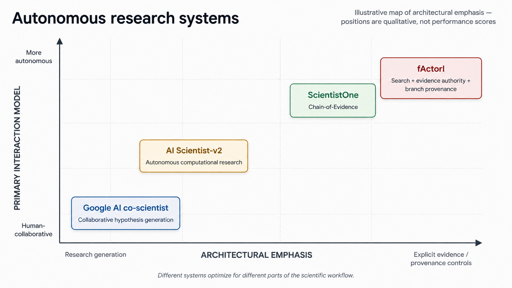
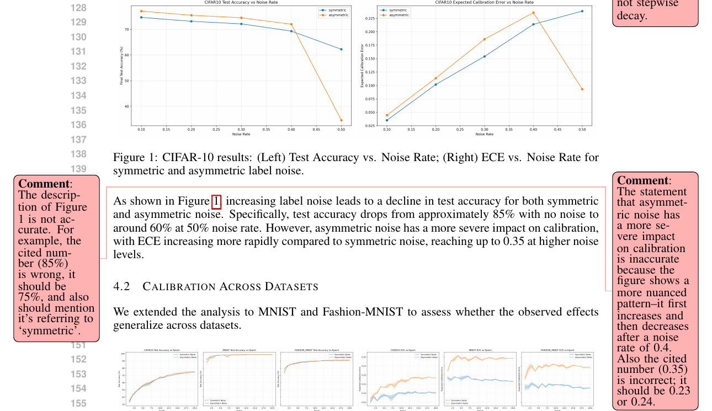
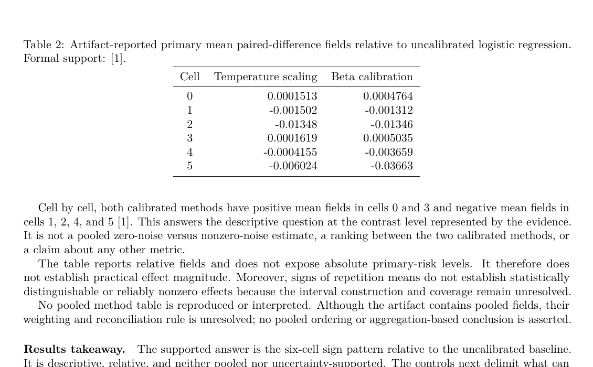

# fActorI

**A multi-fidelity, variance-driven framework for autonomous scientific discovery.**

fActorI aims to automate more of the research process than idea generation or paper writing. Given
a domain, method, or question, it explores a tree of research programs, develops the promising
ones, tests them at increasing levels of rigor, and converges on either a supported contribution or
an explicit account of why the search failed.

The intended output is a **ledgered research object**: a labeled manuscript together with its
candidate tree, literature context, proof or experiment artifacts, failed branches, criticism, and
provenance.

## Lift, Then Filter

The system deliberately preserves variance early. Alternative mechanisms, mathematical lenses,
baselines, counterexamples, and verification paths are explored before expensive validation.
Search then becomes progressively stricter, allocating more effort only to branches that survive.

Adaptive controllers may refine a question, strengthen a baseline, repair code, split a proof,
downgrade a claim, stop a stagnant branch, or redirect the remaining budget. Human intervention is
reserved for high-risk, high-cost, ambiguous, or irreversible decisions.

  

*Implemented for bounded synthetic workflows. Domain-general multi-branch execution remains under
development.*

## Evidence Before Narrative

Exploration, verification, and presentation have different authority. Proposals, criticism,
citations, manuscripts, and PDFs do not become evidence merely because they are persuasive.

  

*Implemented: artifact hashing, ledger commits, execution links, and bounded claim bindings.
Broader Lean verification and real-data evidence routes remain planned.*

Synthetic experiments support only claims within their declared regime. Mathematical claims are
intended to become theorem claims only after formal verification. Unresolved work must remain
labeled as conjecture, negative result, limitation, deferred branch, or failed search.

When several surviving branches share a defensible structure, fActorI attempts to synthesize them
into a common model and attacks that abstraction before using it as the paper nucleus. Otherwise,
it falls back to the strongest supported branch.

## Current State

The prototype implements an end-to-end synthetic experimental path: opportunity discovery,
multi-branch development, literature context, experiment generation and repair, restricted
execution, adversarial criticism, evidence-bounded manuscript synthesis, and hash-linked
provenance.

Currently, the deterministic trust kernel is being migrated from Python to Rust to make critical
integrity and evidence checks harder to bypass. LLM cheating prevention is also under development
to block post-computation metric mutation, partially legitimate output dictionaries, disguised
constants, trivial indirection, self-declared success, seed-insensitive results, and inconsistent
semantic auditing across execution paths.

Its current reliable empirical scope is controlled synthetic research. The generated example below
demonstrates the pipeline; it is not presented as publication-ready science.

**[Example paper](showcase/label-noise-calibration/bundle/paper/final-paper.pdf) |
[Research bundle](showcase/label-noise-calibration/README.md)**

## Models and Providers

The real LLM path currently supports **OpenAI only**. Provider-neutral adapter contracts exist, but
other real LLM providers have not yet been implemented. OpenAlex is used separately for literature
retrieval, while safety checks, execution, metric extraction, provenance validation, and final
assembly are deterministic local operations.

The showcased run split model roles:

| Role | Model |
|---|---|
| Research planning, experiment generation and repair, adaptive questioning, and adjudication | OpenAI gpt-5.6-luna, high reasoning effort |
| Manuscript planning, synthesis, criticism, and revision | OpenAI gpt-5.6-sol, high reasoning effort |

Sol improved the final presentation; it did not create metrics or upgrade experimental evidence.
The full disclosure is retained in the [showcase bundle](showcase/label-noise-calibration/README.md).

## Positioning

Four reference systems capture distinct approaches to AI-assisted research:
[Google AI co-scientist](https://research.google/blog/accelerating-scientific-breakthroughs-with-an-ai-co-scientist/)
emphasizes collaborative hypothesis generation and refinement;
[Sakana AI Scientist-v2](https://github.com/SakanaAI/AI-Scientist-v2) targets autonomous
computational research through paper production; and
[ScientistOne](https://arxiv.org/abs/2605.26340) builds Chain-of-Evidence into literature review,
parallel discovery, writing, and claim verification.

  

ScientistOne reports zero hallucinated references (0/337), 12/12 score-verification passes, and
14/15 method-code alignment in its evaluation. fActorI does not claim superiority over those
results. It explores a complementary architecture: variance-preserving branch search,
progressively more expensive verification, explicit evidence authority, and immutable provenance
for surviving, rejected, deferred, and failed branches. Its final object is the full ledgered
research history, not only the paper.

## When the Plot Says One Thing and the Paper Says Another

*fActorI is designed so the manuscript layer cannot outrun the evidence layer.*

The left crop is from page 3 of the
[annotated AI Scientist-v2 label-noise paper](https://pub.sakana.ai/ai-scientist-v2/paper/paper.pdf).
The right crop is from page 3 of the
[fActorI example paper](showcase/label-noise-calibration/bundle/paper/final-paper.pdf).

  
  

**AI Scientist-v2.** The generated text reports approximately 85% accuracy, ECE up to 0.35, and a
more severe asymmetric effect. The annotations point to roughly 75%, ECE around 0.23 to 0.24, and a
more nuanced, non-monotonic pattern in the displayed figure.

**fActorI.** The manuscript reports the supported cellwise signs, then explicitly declines to claim
a method ranking, practical effect magnitude, pooled result, or statistically distinguishable
effect.

> **The comparison is not about obtaining a better result. It is about controlling what the writer
> is allowed to conclude from that result.**

Same broad topic; different experiments and model stacks. This is an illustrative artifact
comparison, not a controlled performance benchmark.

## Direction

The next major research tracks are:

- **Lean 4 verification.** Complete the adaptive proof controller, bounded lemma splitting, and a
  reusable theorem registry in which Lean artifacts, not model judgments or prose, provide proof
  authority.
- **Broader empirical work.** Extend the data gate from synthetic-only research to reproducible
  public-data and explicitly gated user-provided-data experiments.
- **Deeper autonomous search.** Improve multi-branch tournaments, research memory, reuse of verified
  lemmas and experiment components, budget allocation, and synthesis of several results into a
  genuine shared abstraction.

The long-term system should terminate honestly with a verified or bounded manuscript, an
informative negative result, a conjecture with explicit obligations, or a failed-search report.

## Quick Start

    uv sync --dev

    uv run factori run-all \
      --run-id demo \
      --domain "synthetic probabilistic classification"

    uv run factori replay-verify --run-id demo

The default path uses deterministic development adapters. External models, retrieval, proof tools,
and experiment runners require explicit gates and budgets.

## Documentation

[Architecture](ARCHITECTURE.md) |
[Context](CONTEXT.md) |
[Commands](COMMANDS.md) |
[Protocols](protocols/README.md)

---

**Explore widely, verify selectively, preserve failures, and never let presentation outrun proof.**
