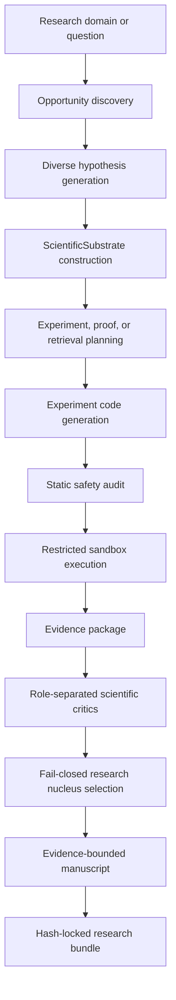

# fActorI

**An evidence-bounded, provenance-aware research orchestration framework**

fActorI is a prototype system for structured hypothesis exploration, controlled experiment
generation and execution, role-separated scientific criticism, and evidence-bounded manuscript
synthesis. Its central design rule is that models may propose, analyze, criticize, and write, but
only validated artifacts determine what the pipeline may present as evidence.

**Hypothesis exploration | Automated experimentation | Evidence provenance | LLM research agents**

> **Prototype status:** fActorI demonstrates research orchestration and evidence discipline. It
> does not claim that generated work is publication-quality or scientifically correct without
> external review.

Repository snapshot, computed on 2026-08-27: **1,312 pytest test functions | 422 exported JSON
Schema contracts | one hash-locked end-to-end research showcase**.

## Why fActorI

LLMs can generate convincing research narratives faster than they can establish that the
underlying evidence supports them. A single model asked to propose an idea, run an experiment, and
write the conclusion can silently move between speculation, observation, and established fact.

fActorI separates scientific proposal, execution, evidence classification, criticism,
adjudication, and manuscript generation. The component writing the narrative has no authority to
upgrade evidence labels, manufacture metrics, or turn synthetic results into real-world
validation.

## Architecture



The main path is not a single prompt followed by a paper. Candidate directions are expanded across
mechanisms, baselines, failure modes, robustness checks, and negative controls. Semantic
duplicates are filtered before selected ideas become typed scientific objects.

### A ScientificSubstrate

A substrate turns a research idea into an inspectable contract. A simplified substrate looks like:

```yaml
question: Does calibration recover clean-posterior quality under training-label noise?
hypothesis: Calibration benefits depend on the corruption mechanism and rate.
model_object: Binary Gaussian-logistic data-generating process with known posterior.
assumptions:
  - Training, calibration, and evaluation splits are disjoint.
  - Calibration and evaluation labels remain clean.
data_regime: SyntheticOnly
baseline: Uncalibrated logistic regression
negative_control: Permuted calibration labels
experiment_design: Six noise-mechanism/rate cells with repeated paired comparisons
success_criteria: Prespecified metric and control checks
robustness_checks: Realized-noise audits, reruns, and regime sensitivity
result_schema: Machine-readable metrics, diagnostics, and failure records
limitations: Synthetic scope; no real-world validation
forbidden_claims: Publication readiness, novelty proof, or general domain truth
```

This structure lets downstream stages reason about a concrete object instead of repeatedly
reinterpreting free-form prose.

## Automated Experiments

```text
LLM experiment specification
  -> generated Python
  -> deterministic AST and policy audit
  -> restricted local execution with fixed resource ceilings
  -> sandbox output.json
  -> metric extraction
  -> evidence package
```

Generated scripts are checked before execution. Network access, child-process creation, path
escape, dynamic execution, and unsafe imports are restricted by policy. Runs use dedicated working
directories, time and memory limits, and declared seed requirements. Metrics enter an evidence
package only through successful process output; unsafe, failed, or incomplete runs remain blocked
or inconclusive.

This is a prototype research sandbox, not a hardened security boundary for hostile code.

## Evidence Authority

The distinctive part of fActorI is not which agent talks to which agent. It is which component is
allowed to assert what.

```text
Proposal             != evidence
LLM criticism        != evidence
Literature citation  != experimental evidence
Manuscript prose     != evidence
Executed output      -> bounded evidence only after contract validation
```

- A prose model can describe persisted evidence but cannot upgrade it.
- A critic can reject or narrow a result but cannot manufacture a better result.
- Retrieval provides literature context but cannot prove novelty or completeness.
- Synthetic experiments can support bounded simulation claims, never empirical validation.
- Presentation artifacts, including Markdown, LaTeX, and PDFs, carry no evidence authority.

### How fActorI tries not to fool itself

- explicit baselines and placebo-style negative controls;
- robustness and regime-sensitivity checks;
- failure criteria declared before interpretation;
- tautology, DGP-rigging, false-bridge, and claim-scope criticism;
- novelty-risk checks without claiming novelty proof;
- negative-result retention;
- role-separated scientific critics;
- fail-closed evidence-package adjudication;
- prohibited conclusions attached to research contracts.

These controls constrain what the system may claim. They do not guarantee that accepted evidence
is scientifically correct.

## Provenance

Every mutating stage writes through a local artifact store and an append-only SQLite ledger.
Artifacts are SHA-256 hashed and linked to producing commits. Parent continuity, forks, artifact
hashes, required outputs, and evidence boundaries can be checked without rewriting history.

```text
LLM call / experiment / decision
  -> persisted artifact
  -> SHA-256 content hash
  -> append-only ledger commit
  -> explicit downstream dependency
```

Checkpointed execution supports bounded resume and explicit rerun policies. Read-only replay and
bundle verification inspect consistency; they do not repair provenance or certify scientific
truth.

## End-to-End Showcase

### Calibration under Symmetric and Class-Conditional Training-Label Noise

The repository includes a complete generated research bundle:

- [paper (PDF)](showcase/label-noise-calibration/bundle/paper/final-paper.pdf)
- [paper (Markdown)](showcase/label-noise-calibration/bundle/paper/final-paper.md)
- [bundle index and model disclosure](showcase/label-noise-calibration/README.md)
- [provenance manifest](showcase/label-noise-calibration/bundle/provenance/provenance-manifest.json)
- [verification report](showcase/label-noise-calibration/bundle/reports/verification-report.json)

The bounded synthetic benchmark contains:

- six experimental cells and 20 repetitions per cell;
- symmetric and class-conditional training-label noise;
- an uncalibrated logistic-regression baseline;
- temperature scaling and beta calibration;
- clean calibration labels and independently generated clean evaluation.

The central artifact-reported clean-posterior Brier-risk differences are relative to the
uncalibrated baseline; negative values are lower:

| Cell | Temperature scaling | Beta calibration |
|---:|---:|---:|
| 0 | 0.0001513 | 0.0004764 |
| 1 | -0.001502 | -0.001312 |
| 2 | -0.01348 | -0.01346 |
| 3 | 0.0001619 | 0.0005035 |
| 4 | -0.0004155 | -0.003659 |
| 5 | -0.006024 | -0.03663 |

The system retained the directional pattern but refused to promote it into a significance,
practical-effect, pooled-effect, or generalization claim. Interval construction was unresolved,
absolute primary-risk levels were unavailable, and the negative control remained inconclusive.
Those limitations remain visible in the paper.

### Models used

The showcased run deliberately split model roles:

| Role | Backend and model |
|---|---|
| Opportunity discovery, variance generation, substrate and route planning, experiment generation and repair, adaptive questioning, and scientific adjudication | OpenAI `gpt-5.6-luna`, reasoning effort `high` |
| Accepted manuscript planning, synthesis, criticism, and revision | OpenAI `gpt-5.6-sol`, reasoning effort `high` |
| Literature retrieval | OpenAlex |
| Safety audit, sandbox execution, metric extraction, claim-binding validation, final assembly, and PDF rendering | Deterministic local tooling |

Model identifiers are recorded in raw adapter artifacts; reasoning effort reflects the command
configuration used for these calls. Sol improved the manuscript presentation; it did not create or
upgrade the experiment evidence.

### One provenance trace

The primary paper statement can be followed backward through the bundle:

```text
Paper result and table
  -> claim/artifact binding
  -> evidence-package result
  -> sandbox output.json
  -> exact metric field
```

- [paper result](showcase/label-noise-calibration/bundle/paper/final-paper.md)
- [claim-to-artifact map](showcase/label-noise-calibration/bundle/reports/claim-artifact-map.json)
- [evidence-package result](showcase/label-noise-calibration/bundle/evidence/evidence-package-result-0005.json)
- [sandbox output](showcase/label-noise-calibration/bundle/evidence/metrics/evidence-package-sandbox-execution-0002-output.json)
- [artifact-bound metric table](showcase/label-noise-calibration/bundle/tables/final-paper-artifact-bound-metrics.json)

The generated implementation is not included in this final bundle, and the paper explicitly
records that reproducibility limitation. The trace demonstrates metric provenance, not complete
independent reproduction.

### Illustrative comparison: why evidence-aware orchestration matters

The [AI Scientist-v2 label-noise paper](https://pub.sakana.ai/ai-scientist-v2/paper/paper.pdf)
is broader and visually closer to a conventional ML workshop paper. Sakana AI's published
evaluation materials also document numerical text/figure mismatches, claims stronger than plotted
evidence, missing or duplicated figures, and experimental-description inconsistencies in generated
papers.

| AI Scientist-v2 example | fActorI example |
|---|---|
| Ambitious multi-dataset deep-learning study | Narrow six-cell synthetic benchmark |
| Richer conventional presentation and figures | Explicit artifact and authority boundaries |
| Some conclusions exceed the displayed experiments | Unresolved uncertainty remains unresolved |
| Human review identifies figure, citation, and method-description problems | Unsupported generalizations are rejected from the manuscript |

**This is an illustrative case study, not a controlled head-to-head benchmark.** It supports a
design hypothesis: architectural constraints on evidence authority can matter as much as raw model
capability.

## Relevance to Quantitative Research

| fActorI concept | Quant-research analogue |
|---|---|
| Hypothesis generation | Alpha or model hypothesis generation |
| Scientific baselines | Benchmark strategies and models |
| Negative controls | Placebo tests |
| DGP checks | Simulation and model-risk analysis |
| Robustness sweeps | Parameter and regime sensitivity |
| Evidence boundaries | Avoiding overstated backtests |
| Append-only provenance | Research audit trail |
| Candidate tournaments | Model or strategy selection |
| Negative-result retention | Reducing survivorship bias |
| Role-separated critics | Research review and model validation |
| Restricted execution | Controlled research compute |
| Claim-to-evidence mapping | Traceable investment thesis |

The architecture is intended to support multiple research routes; the current reliable
end-to-end demonstration focuses on controlled synthetic ML experimentation. A natural next domain
is systematic quantitative research, especially factor robustness, portfolio estimation, regime
sensitivity, and transaction-cost stress testing.

## Engineering

The implementation uses Python 3.11+, Pydantic, SQLite, SHA-256 artifact hashing, Typer, NumPy,
SciPy, scikit-learn, matplotlib, pytest, Ruff, versioned JSON Schemas, checkpointed execution, and
bounded external adapters.

```text
factori/
|-- adapters/       # LLM, retrieval, proof, and experiment boundaries
|-- commands/       # typed command business logic
|-- schemas/        # research, evidence, and provenance contracts
|-- ledger.py       # append-only provenance ledger
|-- persistence.py  # atomic artifact and commit helpers
|-- targeted_study.py
|-- adaptive_evidence.py
|-- generated_experiments.py
|-- nucleus_manuscript.py
|-- final_paper.py
`-- cli.py          # Typer command interface
```

## Quick Start

Install the local development environment:

```bash
uv sync --dev
```

Run the deterministic structural pipeline without external calls:

```bash
uv run factori run-all \
  --run-id readme-demo \
  --domain "synthetic probabilistic classification"

uv run factori replay-verify --run-id readme-demo
```

This default path uses deterministic development adapters. It tests contracts and provenance; it
does not constitute scientific validation. Real model, retrieval, proof, or experiment backends
require explicit safety gates, credentials or local tools, and budgets.

Run the test and lint checks:

```bash
uv run pytest
uv run ruff check .
```

The full command catalog is in [COMMANDS.md](COMMANDS.md).

## Current Boundaries

- prototype, not production infrastructure;
- no guarantee that generated research is correct or publication-quality;
- no exhaustive literature review or automatic novelty proof;
- synthetic evidence does not imply real-world validity;
- role separation does not guarantee independent model or provider judgment;
- the local sandbox is not a hardened hostile-code container;
- generated manuscripts remain human-review artifacts;
- the current showcase is not a financial strategy or alpha result;
- final structural verification intentionally preserves `publication_ready=false`.

## Next Steps

1. Add a quantitative-finance demonstration with placebo tests, regime sensitivity, transaction
   costs, and strict out-of-sample boundaries.
2. Strengthen the statistical layer with preregistered inferential rules, uncertainty procedures,
   and multiple-testing controls.
3. Use rejected and negative branches as research memory for deduplication and budget allocation.
4. Increase proposer, experimenter, critic, and writer diversity across models and providers.

## Project Ownership

The repository author designed and implemented the framework architecture, provenance model,
evidence boundaries, orchestration, experiment sandbox, critic/adjudication structure, and final
assembly. LLMs operated inside those contracts for research proposals, experiment code and repairs,
scientific criticism, and manuscript generation where disclosed above.

## Documentation

- [Project context](CONTEXT.md)
- [Architecture and invariants](ARCHITECTURE.md)
- [Module map](MODULE_MAP.md)
- [Command reference](COMMANDS.md)
- [Protocol contracts](protocols/README.md)
- [Milestone history](MILESTONES.md)

---

**fActorI is an experiment in making autonomous research systems accountable to their evidence:
models may propose, experiment, criticize, and write, but only executed and validated artifacts
determine what the system is allowed to claim.**

**[Paper](showcase/label-noise-calibration/bundle/paper/final-paper.pdf) |
[Bundle](showcase/label-noise-calibration/README.md) |
[Architecture](ARCHITECTURE.md) |
[Commands](COMMANDS.md)**
